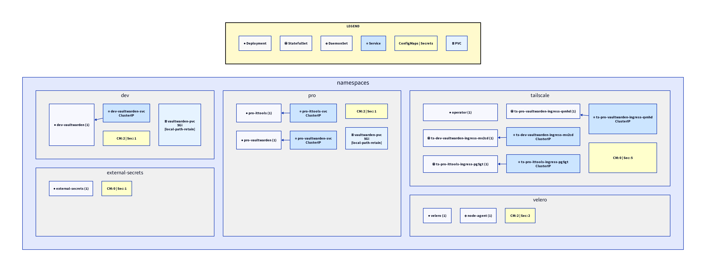

<p align="center">
  
</p>

# k8s-d2

[](https://goreportcard.com/report/github.com/vieitesss/k8s-d2)
[](LICENSE)
[](https://github.com/vieitesss/k8s-d2/releases)

A command-line tool that generates [D2](https://d2lang.com/) diagram files from Kubernetes cluster topology. Visualize your cluster's namespaces, workloads, services, and their relationships as code.



## Features

- Generate D2 diagrams from live Kubernetes clusters
- Visualize workloads (Deployments, StatefulSets, DaemonSets) with distinct icons
- Map service-to-workload relationships
- Filter by namespace or view entire cluster
- Track ConfigMaps and Secrets per namespace
- Customizable grid layout for namespace organization
- Output to file or stdout for pipeline integration
- Generate SVG images directly via [Kroki](https://kroki.io/) API (no local D2 installation required)

## Installation

### Homebrew (macOS/Linux)

```bash
brew install vieitesss/tap/k8s-d2
```

### Go Install

```bash
go install github.com/vieitesss/k8s-d2@latest
```

### Pre-compiled Binaries

Download the latest release for your platform from the [releases page](https://github.com/vieitesss/k8s-d2/releases):

1. Choose the appropriate archive for your system:
   - Linux (x86_64): `k8s-d2_*_Linux_x86_64.tar.gz`
   - Linux (ARM64): `k8s-d2_*_Linux_arm64.tar.gz`
   - macOS (Intel): `k8s-d2_*_Darwin_x86_64.tar.gz`
   - macOS (Apple Silicon): `k8s-d2_*_Darwin_arm64.tar.gz`
   - Windows: `k8s-d2_*_Windows_*.zip`

2. Extract the archive and move the `k8sdd` binary to your PATH:

```bash
tar -xzf k8s-d2_*_*.tar.gz
sudo mv k8sdd /usr/local/bin/  # Linux/macOS
```

For Windows, extract the `.zip` file and add the binary to your PATH.

### Build from Source

```bash
git clone https://github.com/vieitesss/k8s-d2.git
cd k8s-d2
go build -o k8sdd .
```

## Quick Start

Generate a diagram from your current Kubernetes context:

```bash
k8sdd diagram -o cluster.d2
```

Render the diagram with D2:

```bash
d2 cluster.d2 cluster.svg
```

Or generate an SVG directly (no D2 installation required):

```bash
k8sdd diagram -i cluster.svg
```

## Usage

### Basic Commands

```bash
# Output D2 to stdout
k8sdd diagram

# Save D2 to file
k8sdd diagram -o cluster.d2

# Generate SVG image directly via Kroki API
k8sdd diagram -i cluster.svg

# Visualize specific namespace
k8sdd diagram -n monitoring -o monitoring.d2

# Include all namespaces (including system namespaces)
k8sdd diagram --all-namespaces -o full-cluster.d2

# Use custom kubeconfig
k8sdd diagram --kubeconfig ~/.kube/prod-config -o prod.d2
```

### Layout Options

```bash
# Control namespace grid layout (default: 3 columns)
k8sdd diagram --grid-columns 2 -o wide-layout.d2

# Single column layout
k8sdd diagram --grid-columns 1 -o vertical.d2
```

### Advanced Usage

```bash
# Include storage layer (PVCs, StorageClasses)
k8sdd diagram --include-storage -o storage.d2

# Combine options
k8sdd diagram --all-namespaces --include-storage --grid-columns 4 -o complete.d2

# Generate SVG with storage layer
k8sdd diagram --include-storage -i cluster-with-storage.svg

# Quiet mode (suppress progress indicators)
k8sdd diagram -q -o cluster.d2
```

## Flags

| Flag | Short | Default | Description |
|------|-------|---------|-------------|
| `--kubeconfig` | | `~/.kube/config` | Path to kubeconfig file |
| `--namespace` | `-n` | | Filter by specific namespace |
| `--all-namespaces` | `-A` | `false` | Include system namespaces |
| `--output` | `-o` | stdout | Output D2 file path |
| `--image` | `-i` | | Output SVG image file (uses Kroki API) |
| `--grid-columns` | | `3` | Number of columns for namespace layout |
| `--include-storage` | | `false` | Include PVCs and StorageClasses |
| `--quiet` | `-q` | `false` | Suppress progress indicators and log messages |

> **Note:** `--output` and `--image` are mutually exclusive.

## Output Format

The tool generates D2 syntax representing your cluster topology:

- **Namespaces**: Containers with light gray fill (`#f0f0f0`)
- **Workloads**: Nodes with type-specific icons
  - Deployments: ●
  - StatefulSets: ◉
  - DaemonSets: ◈
- **Services**: Blue-filled nodes (`#cce5ff`) showing service type
- **Config/Secrets**: Yellow-filled summary node (`#ffffcc`)
- **Connections**: Service-to-workload relationships via selectors

See [examples/sample-output.d2](examples/sample-output.d2) for reference output.

## Requirements

- Kubernetes cluster access via kubeconfig
- Valid KUBECONFIG or `~/.kube/config` file
- [D2](https://d2lang.com/) for rendering diagrams locally (optional - you can use `--image` flag to generate SVG via Kroki API instead)

## Project Structure

```
cmd/
  root.go       # CLI setup and global flags
  diagram.go    # Diagram subcommand definition
  generate.go   # Main generation command logic
pkg/
  kube/
    client.go   # Kubernetes client initialization
    fetch.go    # Resource fetching and filtering
  kroki/
    client.go   # Kroki API client for SVG generation
  model/
    types.go    # Internal graph representation
  render/
    d2.go       # D2 syntax generation
main.go         # Application entry point
```

## Roadmap

- [x] Phase 1: Basic topology (namespaces, workloads, services)
- [x] Phase 2: Storage layer (PVCs, volumes, StorageClasses)
- [x] SVG generation via Kroki API
- [ ] Phase 3: Network layer (Ingress, NetworkPolicies)
- [ ] Custom styling themes
- [ ] Interactive filtering and drill-down

## Contributing

Contributions are welcome! Please open an issue or submit a pull request.

## License

MIT License - see [LICENSE](LICENSE) file for details.

## Acknowledgments

Built with:
- [Cobra](https://github.com/spf13/cobra) - CLI framework
- [client-go](https://github.com/kubernetes/client-go) - Kubernetes API client
- [D2](https://d2lang.com/) - Declarative diagramming language
- [Kroki](https://kroki.io/) - Diagram rendering API
