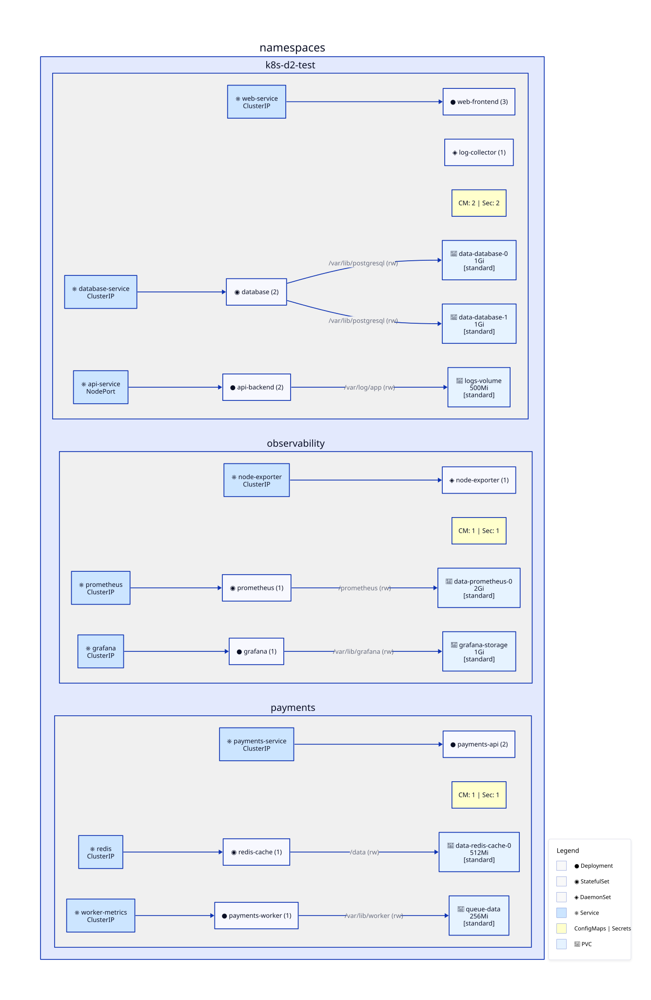

<p align="center">
  
</p>

# k8s-d2

[](https://goreportcard.com/report/github.com/vieitesss/k8s-d2)
[](LICENSE)
[](https://github.com/vieitesss/k8s-d2/releases)

A command-line tool that generates [D2](https://d2lang.com/) diagram files from Kubernetes cluster topology. Visualize your cluster's namespaces, workloads, services, and their relationships as code.

> Note: This README tracks the `main` branch. If you are using the latest stable release, check the matching Git tag or the [release notes](https://github.com/vieitesss/k8s-d2/releases) for the shipped CLI behavior and flags.



## Features

- Generate D2 diagrams from live Kubernetes clusters
- Visualize workloads (Deployments, StatefulSets, DaemonSets) with distinct icons
- Map service-to-workload relationships
- Filter by namespace or view entire cluster
- Track ConfigMaps and Secrets per namespace
- Use D2 automatic layout for cleaner topology diagrams
- Output to file or stdout for pipeline integration
- Generate SVG images directly via [Kroki](https://kroki.io/) API (no local D2 installation required)

## Installation

### Homebrew (macOS/Linux)

```bash
brew install vieitesss/tap/k8s-d2
```

### Go Install

```bash
go install github.com/vieitesss/k8s-d2@latest
```

### Pre-compiled Binaries

Download the latest release for your platform from the [releases page](https://github.com/vieitesss/k8s-d2/releases), then extract the archive and move the `k8sdd` binary to your PATH:

```bash
tar -xzf k8s-d2_*_*.tar.gz
sudo mv k8sdd /usr/local/bin/  # Linux/macOS
```

For Windows, extract the `.zip` file and add the binary to your PATH.

### Build from Source

```bash
git clone https://github.com/vieitesss/k8s-d2.git
cd k8s-d2
go build -o k8sdd .
```

## Quick Start

Generate a diagram from your current Kubernetes context:

```bash
k8sdd diagram -o cluster.d2
```

Render the diagram with D2:

```bash
d2 cluster.d2 cluster.svg
```

Or generate an SVG directly (no D2 installation required):

```bash
k8sdd diagram -i cluster.svg
```

## Flags

| Flag | Short | Default | Description |
|------|-------|---------|-------------|
| `--kubeconfig` | | `~/.kube/config` | Path to kubeconfig file |
| `--namespace` | `-n` | | Filter by specific namespaces (repeat or comma-separated) |
| `--all-namespaces` | `-A` | `false` | Include system namespaces |
| `--output` | `-o` | stdout | Output D2 file path |
| `--image` | `-i` | | Output SVG image file (uses Kroki API) |
| `--include-storage` | | `false` | Include PVCs and StorageClasses |
| `--quiet` | `-q` | `false` | Suppress progress indicators and log messages |

> **Note:** `--output` and `--image` are mutually exclusive.

## Requirements

- Kubernetes cluster access via kubeconfig
- Valid KUBECONFIG or `~/.kube/config` file
- [D2](https://d2lang.com/) for rendering diagrams locally (optional - you can use `--image` flag to generate SVG via Kroki API instead)

## Contributing

Contributions are welcome! Please open an issue or submit a pull request.

## Acknowledgments

Built with:
- [Cobra](https://github.com/spf13/cobra) - CLI framework
- [client-go](https://github.com/kubernetes/client-go) - Kubernetes API client
- [D2](https://d2lang.com/) - Declarative diagramming language
- [Kroki](https://kroki.io/) - Diagram rendering API
